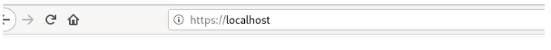

<h3>INSTAL·LACIÓ DE MOODLE AMB DOCKER-COMPOSE</h3>

**Prerequisit**: Tenir instal·lat Docker.

Docker us ve preinstal·lat al Debian 11 de l’escola. Si ho volguéssiu instal·lar a casa, primer haurieu d’instal·lar Docker.

El següent que farem és instal·lar Docker-compose.

Primer descarregarem la última versió estable de docker-compose. Escriurem al terminal:
```bash
$ sudo curl -L
"https://github.com/docker/compose/releases/download/1.29.2/docker
-compose-$(uname -s)-$(uname -m)" -o /usr/local/bin/docker-compose
```
Donarem permisos al docker-compose:
```bash
$ sudo chmod +x /usr/local/bin/docker-compose
```

Comprovarem que hem instal·lat correctament docker-compose:
```bash
$ sudo docker-compose --version
```

Descarreguem el fitxer *docker-compose.yml* de moodle. El guardem a un directori que tinguem permisos.

Un altre cop al terminal i dins del directori on tinguem descarregat el *docker-compose.yml*, escriurem:
```bash
$ sudo docker-compose up -d
```
Un cop hagi acabat la instal·lació, obrirem un navegador i escriurem a la url *localhost*.


Se’ns obrirà un moodle. Podem logar-nos fent servir les següents credencials:

\-usuari: user

\-contrassenya: bitnami

Cada cop que apaguem l’ordinador haurem d’escriure el següent:


```bash
$ sudo docker ps -a
```
Ens llistarà els contenidors que tenim en marxa. Hem de reiniciar-los, escrivint:
```bash
$ sudo docker restart nom\_del\_contenidor
```

on *nom\_del\_contenidor* serà el nom que ens aparegui al fer *sudo docker ps -a*.

------------------------------

Font: https://docs.docker.com/compose/install/

------------------------------

Github personal con los deberes: https://github.com/IanRull/Homework/blob/main/M03-HISM-UF1_Tasca1-Rull-Ian.md

Captura usada en el documento: https://github.com/IanRull/Homework/blob/main/Screenshot_2021-11-08_10-57-27.png
